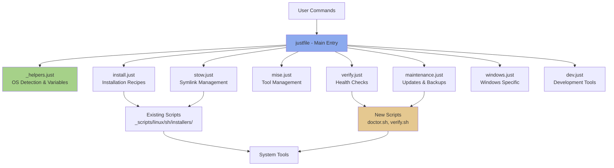
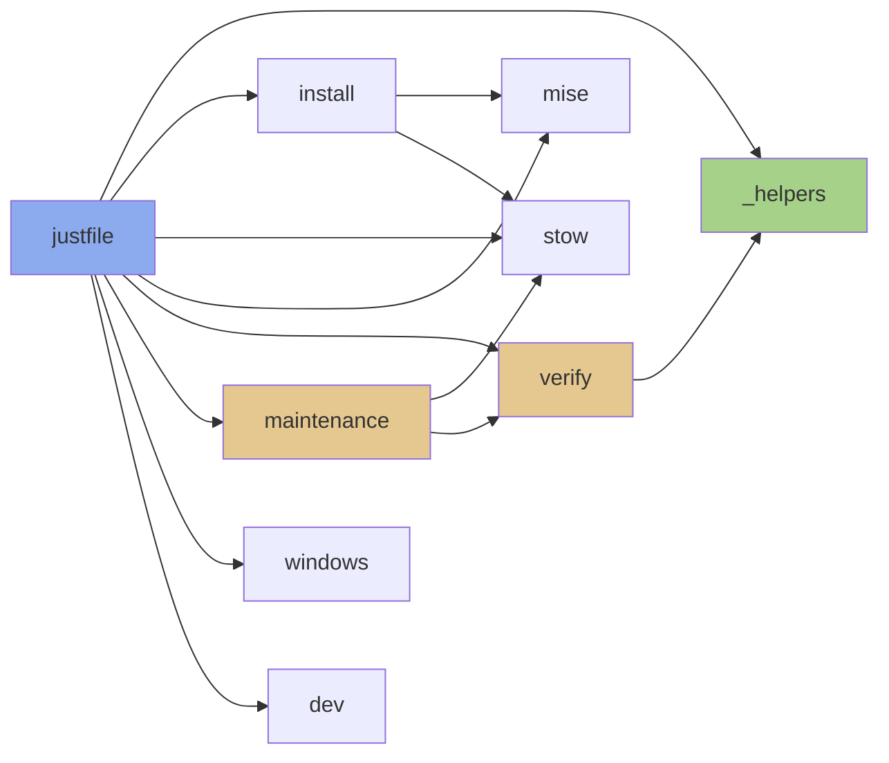
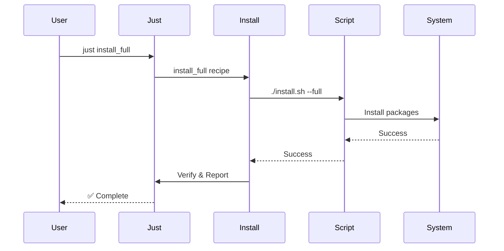
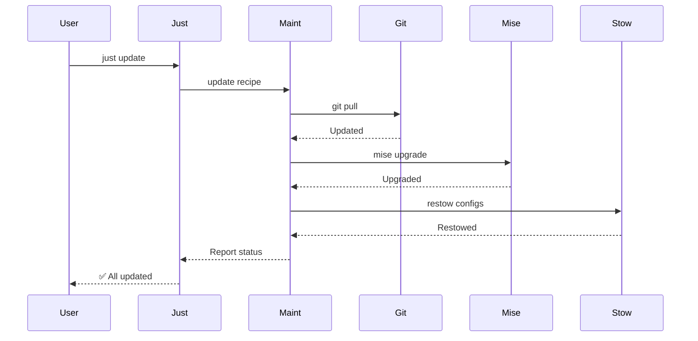
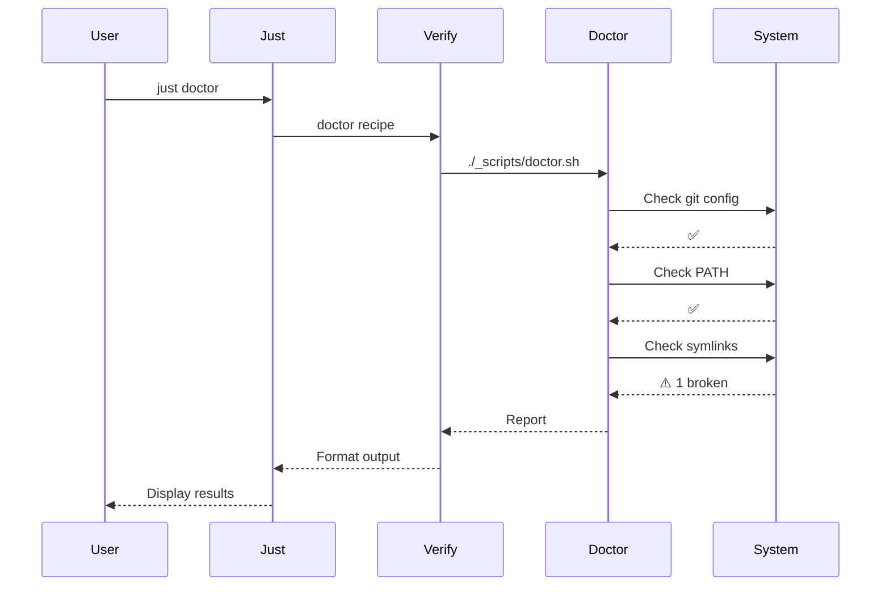

# Architecture

## System Overview

The Just integration follows a modular, layered architecture designed for maintainability and cross-platform compatibility.

## High-Level Architecture



## Module Dependency Graph



## File Structure

```
~/.files/
├── justfile                          # Main entry point
├── .just/                            # Modular recipe files
│   ├── _helpers.just                 # Variables, OS detection
│   ├── install.just                  # Installation workflows
│   ├── stow.just                     # Symlink management
│   ├── mise.just                     # Tool version management
│   ├── verify.just                   # Health checks (NEW)
│   ├── maintenance.just              # Updates & backups (NEW)
│   ├── windows.just                  # Windows-specific
│   └── dev.just                      # Development tools
├── specs/
│   └── just-integration/
│       └── 2026-02-04/
│           └── specification.md      # This dated spec
├── docs/                             # MkDocs documentation
│   ├── index.md
│   └── specs/just-integration/       # Generated docs
└── _scripts/
    ├── just/
    │   ├── install-just.sh           # Just installer (Unix)
    │   ├── install-just.ps1          # Just installer (Windows)
    │   └── bootstrap.sh              # Bootstrap script
    ├── doctor.sh                     # Health check (NEW)
    ├── verify.sh                     # Verification (NEW)
    └── linux/sh/                     # Existing scripts
        ├── installers/
        └── tools/
```

## Design Principles

### 1. Separation of Concerns

- **justfile**: Entry point and imports
- **Module files**: Grouped by functionality
- **Scripts**: Implementation details
- **Just recipes**: User-friendly interface

### 2. Platform Abstraction

```just
# OS detection in _helpers.just
os_type := os()  # "linux", "macos", "windows"

# Conditional recipes
[unix]
install_zsh:
    ./_scripts/linux/sh/installers/install-zsh.sh

[windows]
win_install_powershell:
    pwsh -File ./_scripts/windows/pwsh/setup-windows.ps1
```

### 3. Composition Over Inheritance

Modules import and call each other:

```just
# In maintenance.just
update:
    git pull
    just mise_upgrade      # Call mise.just recipe
    just restow            # Call stow.just recipe
```

### 4. Backward Compatibility

Just wraps existing scripts without replacing them:

```just
install_mise:
    # Calls proven script
    ./_scripts/linux/sh/installers/install-mise.sh

    # Does NOT reimplement:
    # #!/usr/bin/env bash
    # curl https://mise.run | sh
    # ...
```

## Data Flow

### Installation Flow



### Update Flow



### Doctor Flow



## Module Responsibilities

### Core Modules

| Module | Responsibility | Complexity |
|--------|---------------|------------|
| `justfile` | Entry point, imports | Low |
| `_helpers.just` | Variables, OS detection | Low |

### Feature Modules

| Module | Responsibility | Complexity |
|--------|---------------|------------|
| `install.just` | Wrap installation scripts | Medium |
| `stow.just` | Symlink management | Low |
| `mise.just` | Tool version management | Low |
| `verify.just` | Health checks & verification | Medium |
| `maintenance.just` | Updates, backups, cleanup | Medium |
| `windows.just` | Windows-specific tasks | Medium |
| `dev.just` | Development tools | Low |

## Cross-Platform Strategy

### OS Detection

```just
# _helpers.just
os_type := os()
is_windows := if os() == "windows" { "true" } else { "false" }
is_macos := if os() == "macos" { "true" } else { "false" }
is_linux := if os() == "linux" { "true" } else { "false" }
```

### Conditional Execution

**Method 1: Recipe Attributes**

```just
[unix]
install_homebrew:
    ./_scripts/linux/sh/installers/install-homebrew.sh

[windows]
win_install_choco:
    pwsh -File ./_scripts/installers/pwsh/choco.ps1
```

**Method 2: Branching**

```just
install_package PACKAGE:
    #!/usr/bin/env bash
    if [ "{{os()}}" = "windows" ]; then
        pwsh -Command "choco install {{PACKAGE}}"
    elif [ "{{os()}}" = "macos" ]; then
        brew install {{PACKAGE}}
    else
        sudo apt-get install -y {{PACKAGE}}
    fi
```

## Error Handling Strategy

### Fail Fast

```just
# Default: stop on first error
install_full:
    just install_mise
    just install_zsh
    just stow
```

### Graceful Degradation

```just
# Optional components don't block
install_optional:
    just install_fonts || true
    just install_clawdbot || true
```

### Validation

```just
install_component COMP:
    #!/usr/bin/env bash
    set -euo pipefail

    if [ ! -f "{{installers}}/install-{{COMP}}.sh" ]; then
        echo "❌ Unknown component: {{COMP}}"
        exit 1
    fi

    {{installers}}/install-{{COMP}}.sh
```

## Extension Points

### Adding New Recipes

1. Choose appropriate module file
2. Add recipe following naming convention
3. Add to navigation if user-facing
4. Document in recipes.md

### Adding New Modules

1. Create `.just/newmodule.just`
2. Import in `justfile`
3. Follow dependency graph
4. Add tests in `dev.just`

### Platform-Specific Extensions

1. Use `[platform]` attributes
2. Or create platform-specific module
3. Document platform requirements
4. Test on target platform

## Performance Considerations

### Lazy Loading

Just loads recipes on-demand, no performance penalty for many recipes.

### Parallel Execution

```just
# Sequential (default)
install_all:
    just install_mise
    just install_zsh

# Parallel (future enhancement)
install_parallel:
    just install_mise & just install_zsh & wait
```

### Caching

- Just caches recipe list
- Scripts handle their own caching (mise, package managers)

---

[← Back to Specification](specification.md) | [Next: Recipes Reference →](recipes.md)
