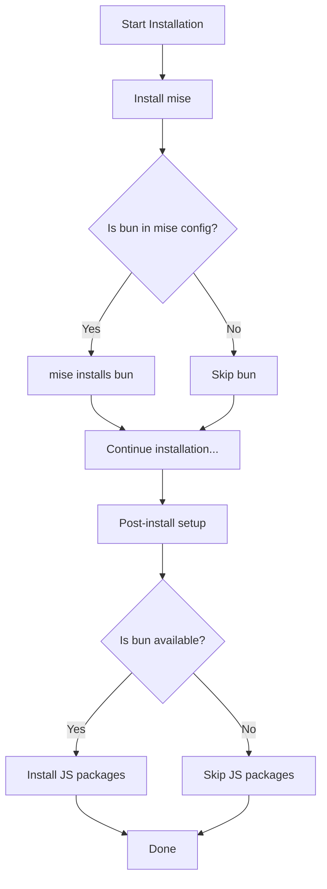

# Installation Flow - JavaScript Packages Integration

## What Happens During Installation

### Full Installation (`./install.sh --full`)

```
1. Prerequisites check (git, curl)
2. Backup existing configs
3. Install Homebrew (macOS only)
4. Install mise
5. Install core tools (zsh, stow)
6. Install optional tools (bat, eza, fzf, etc.)
7. Install .NET SDK
8. Install mise tools from config
9. Stow configurations (symlink dotfiles)
10. POST-INSTALL: ← JavaScript packages run here!
    - Create ~/.gitconfig.local
    - Create ~/.env, ~/.envrc
    - Install JavaScript packages (if bun available) ✨ NEW!
11. Show completion message
```

### When JavaScript Packages Install

During **post_install** (step 10), the script:

1. **Checks if bun is installed**
   ```bash
   if command -v bun &> /dev/null; then
   ```

2. **If bun available:**
   - Runs `./_scripts/linux/sh/installers/install-js-packages.sh --yes`
   - Reads packages from `_scripts/linux/config/js.pkg.yml`
   - Installs all packages globally
   - Shows summary (installed/failed/skipped)

3. **If bun NOT available:**
   - Skips JavaScript packages
   - Shows message: "Install bun and run: ./_scripts/linux/sh/installers/install-js-packages.sh"

### Non-Blocking Behavior

- JavaScript package installation **does not fail** the main installation
- Uses `|| log_warn "..."` to continue even if packages have issues
- Optional feature that enhances the installation

---

## Installation Order



---

## How to Ensure bun is Installed

### Option 1: Add bun to mise config (Recommended)

Edit `mise/.config/mise/config.toml`:

```toml
[tools]
bun = "latest"
# ... other tools
```

Then bun will be installed automatically during `mise install` step.

### Option 2: Install bun separately

Before running `./install.sh`:

```bash
# Install bun
curl -fsSL https://bun.sh/install | bash
source ~/.bashrc

# Then run full installation
./install.sh --full
```

### Option 3: Install bun after main installation

```bash
# Run main installation first
./install.sh --full

# Then install bun
curl -fsSL https://bun.sh/install | bash
source ~/.bashrc

# Then install JS packages
cd ~/.files
./_scripts/linux/sh/installers/install-js-packages.sh
```

---

## Example Output

### With bun available:

```
[STEP] Running post-install setup...
[INFO] Creating ~/.gitconfig.local for personal git settings...
[INFO] Created ~/.env for environment variables
[INFO] Created ~/.envrc for direnv
[STEP] Installing JavaScript/TypeScript packages...
[STEP] Reading package list from: /path/to/_scripts/linux/config/js.pkg.yml
[INFO] Found 25 packages to install
[INFO] Installing: typescript
[✓] typescript installed
[INFO] Installing: prettier
[✓] prettier installed
...
[✓] JavaScript packages installation complete
[✓] Post-install setup complete
```

### Without bun:

```
[STEP] Running post-install setup...
[INFO] Creating ~/.gitconfig.local for personal git settings...
[INFO] Created ~/.env for environment variables
[INFO] Created ~/.envrc for direnv
[INFO] bun not available, skipping JavaScript packages installation
[INFO] Install bun and run: ./_scripts/linux/sh/installers/install-js-packages.sh
[✓] Post-install setup complete
```

---

## Manual Installation Anytime

You can always run the JavaScript packages installer separately:

```bash
cd ~/.files

# Interactive (asks for confirmation)
./_scripts/linux/sh/installers/install-js-packages.sh

# Automatic (no prompts)
./_scripts/linux/sh/installers/install-js-packages.sh --yes

# Update all packages
./_scripts/linux/sh/installers/install-js-packages.sh --update

# List installed packages
./_scripts/linux/sh/installers/install-js-packages.sh --list
```

---

## Customizing Packages

Before or after installation, edit the config:

```bash
nano _scripts/linux/config/js.pkg.yml
```

Add/remove packages:

```yaml
packages:
  - typescript
  - prettier
  - your-package-here  # Add your packages
```

Then run:

```bash
./_scripts/linux/sh/installers/install-js-packages.sh
```

It will skip already-installed packages and only install new ones.

---

## Complete Flow Summary

1. **User runs:** `./install.sh --full`
2. **Script installs:** System tools, mise, optional tools, .NET
3. **mise installs:** All tools from `mise/.config/mise/config.toml` (including bun if configured)
4. **Post-install runs:** Creates configs, then installs JS packages if bun available
5. **User sees:** Completion message with next steps
6. **User can:** Restart shell and all tools (including JS packages) are ready

Perfect integration! 🎉
