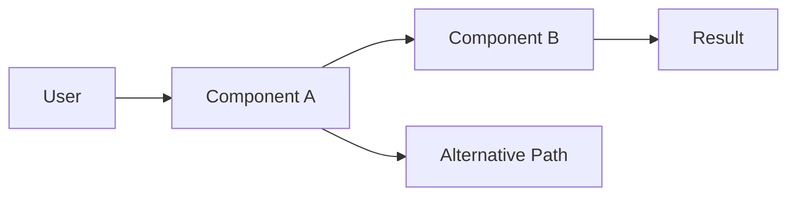
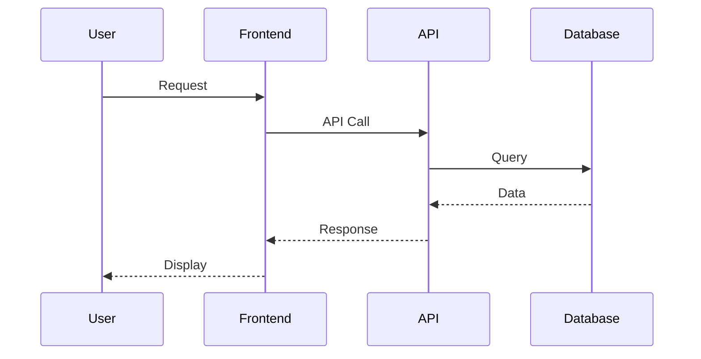
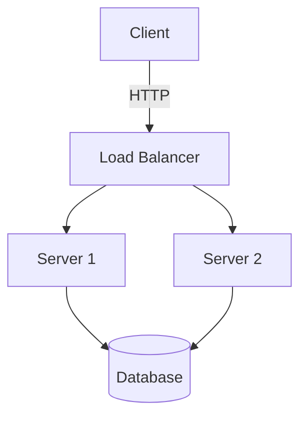
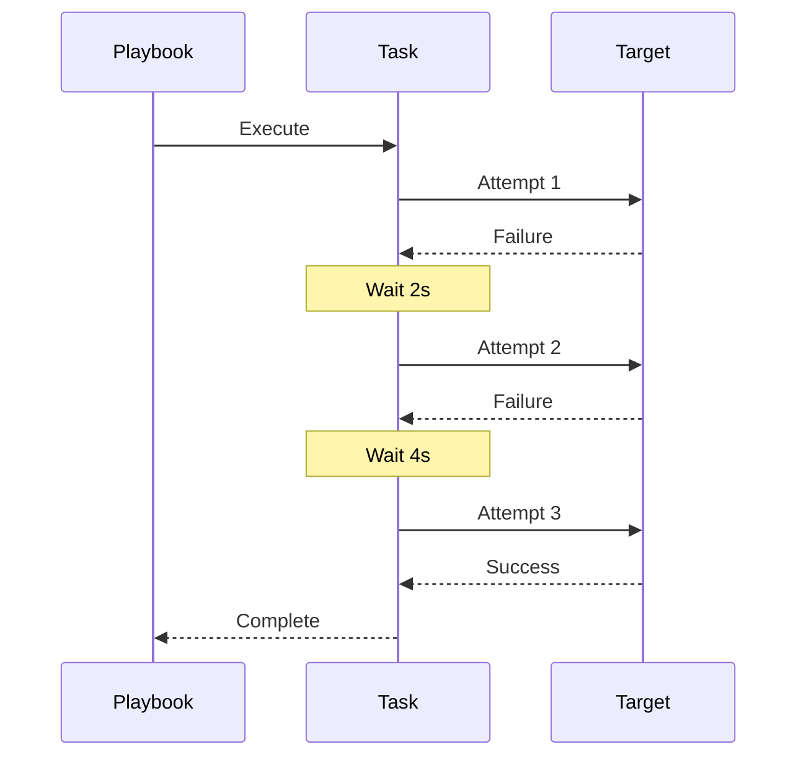

# Feature Issue Structure

This document defines the common structure for feature requests across all platforms (GitHub, Gitea, Azure DevOps).

## Title Format

- Clear, actionable statement (50-70 characters)
- Start with action verb: "Add", "Support", "Implement", "Enable"
- Be specific but concise

**Examples:**

- ✅ "Add support for custom DNS resolvers"
- ✅ "Implement rate limiting for API endpoints"
- ✅ "Enable multi-region deployment"
- ❌ "DNS thing" (too vague)
- ❌ "We should probably add rate limiting at some point" (not actionable)
- ❌ "Implement comprehensive enterprise-grade multi-region deployment strategy" (too long)

## Body Structure

```markdown
## Summary

[2-3 sentence overview of the feature and its value]

## Motivation

[Why is this feature needed? What problem does it solve?]

## Proposed Solution

[High-level description of how this could work]

## Alternatives Considered

[Optional: Other approaches you've thought about]

## Additional Context

[Optional: Screenshots, mockups, links, examples from other projects]
```

## Smart Condensing Rules

- If user provides minimal description → Generate Summary + Motivation
- If user provides moderate description → Generate full structure except Alternatives
- If user provides detailed description → Use full structure
- Always keep each section to 1-3 sentences
- Use bullet points for clarity when listing multiple items
- **Always use Mermaid diagrams** for architecture, workflows, and data flows instead of plain text diagrams

## Mermaid Diagram Guidelines

When visualizing architecture, workflows, or data flows, use Mermaid syntax:

### Flow Diagrams



### Sequence Diagrams



### Architecture Diagrams



## Content Guidelines

- Be specific about the problem, not just the solution
- Include concrete examples when possible
- Reference related issues or PRs if applicable
- Keep each section focused and brief
- Use code blocks for syntax examples
- Use bullet points for lists (more scannable)
- Use Mermaid diagrams for visualizations

## Examples by Description Length

### Minimal Description

**Input:** "add dark mode support"

**Generated:**

Title: `Add dark mode support for UI components`

Body:

```markdown
## Summary

Add support for dark mode theme across all UI components to improve user experience in low-light environments.

## Motivation

Users working in low-light conditions would benefit from a dark color scheme. This is a commonly requested feature that improves accessibility and reduces eye strain.

## Proposed Solution

Implement a theme toggle that switches between light and dark color palettes, persisting user preference in localStorage.
```

### Moderate Description

**Input:** "add support for importing terraform modules from private git repos using ssh authentication instead of just https"

**Generated:**

Title: `Support SSH authentication for private Git repository module imports`

Body:

```markdown
## Summary

Enable Terraform module imports from private Git repositories using SSH authentication as an alternative to HTTPS.

## Motivation

Teams using SSH keys for Git authentication cannot currently import private modules without setting up HTTPS credentials. SSH authentication is more secure for automated workflows and CI/CD pipelines.

## Proposed Solution

- Support `git::ssh://` URL scheme in module sources
- Allow SSH key configuration via environment variables or config files
- Update documentation with SSH authentication examples

## Additional Context

Similar to how Terraform Cloud handles private module sources.
```

### Detailed Description

**Input:** "I need a way to automatically retry failed ansible tasks with exponential backoff. Right now when a task fails due to network issues we have to manually re-run the entire playbook. I'd like to configure retries per task with configurable delays between attempts, maybe using until loops but more intuitive."

**Generated:**

Title: `Implement automatic task retry with exponential backoff`

Body:

```markdown
## Summary

Add native support for automatic task retries with configurable exponential backoff to handle transient failures gracefully.

## Motivation

Network instability and temporary service unavailability cause playbook failures that require manual intervention. Automatic retries would improve reliability in production deployments and CI/CD pipelines.

## Proposed Solution

Add retry configuration to task directives with exponential backoff support:



**Features:**

- Add `retry` directive to task configuration
- Support exponential backoff with configurable base delay
- Allow max retry attempts configuration
- Provide retry conditions (e.g., specific error codes)

Example syntax:

```yaml
- name: Download package
  get_url:
    url: https://example.com/package.tar.gz
    dest: /tmp/package.tar.gz
  retry:
    max_attempts: 5
    backoff: exponential
    base_delay: 2
```

## Alternatives Considered

- Using `until` loops with `retries` - works but verbose and not intuitive
- External retry wrapper scripts - adds complexity outside playbook

## Additional Context

Similar to Kubernetes backoff policies and GitHub Actions retry mechanisms.

```yaml
