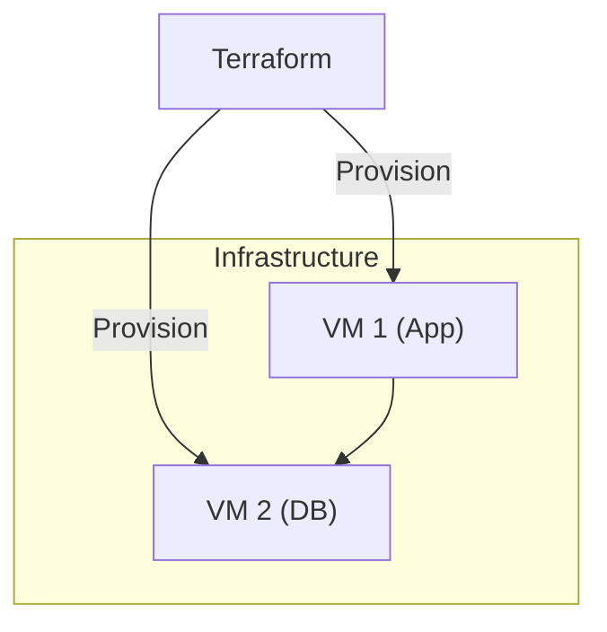

# Azure DevOps Feature Creator

## Overview

This skill creates professional Azure DevOps feature work items using the `az devops` CLI. It generates well-structured work items that follow Azure DevOps conventions and best practices.

## When to Use

- User executes `/feature-az <description>` command
- User asks to "create an Azure DevOps feature"
- User requests "new Azure DevOps work item"
- User is working with Azure DevOps projects

## Prerequisites

### Azure CLI with DevOps Extension Installation

**macOS:**

```bash
brew install azure-cli
az extension add --name azure-devops
az login
az devops configure --defaults organization=https://dev.azure.com/yourorg project=YourProject
```

**Linux (Debian/Ubuntu):**

```bash
curl -sL https://aka.ms/InstallAzureCLIDeb | sudo bash
az extension add --name azure-devops
az login
az devops configure --defaults organization=https://dev.azure.com/yourorg project=YourProject
```

**Windows:**

```powershell
winget install -e --id Microsoft.AzureCLI
az extension add --name azure-devops
az login
az devops configure --defaults organization=https://dev.azure.com/yourorg project=YourProject
```

### Authentication

Ensure you're authenticated:

```bash
az account show
```

If not authenticated, run:

```bash
az login
```

### Configure Defaults

Set your default organization and project:

```bash
az devops configure --defaults \
  organization=https://dev.azure.com/yourorg \
  project=YourProject
```

Verify configuration:

```bash
az devops configure --list
```

## Workflow

### 1. Parse Input

Extract the feature description from user input:

- Accept short descriptions (3-10 words minimum)
- Accept longer detailed descriptions
- If description is too vague, ask clarifying questions

### 2. Detect Project Context

Check if Azure DevOps project is configured:

```bash
# Check if az devops is configured
az devops project show 2>/dev/null

# Or get from git remote (if using Azure Repos)
git config --get remote.origin.url | grep -i "dev.azure.com\|visualstudio.com"
```

If not configured, ask user to specify organization and project.

**Parse organization and project from git remote:**

```bash
# Example remote: https://dev.azure.com/org/project/_git/repo
# Extract org and project
```

### 3. Generate Work Item Structure

Use the shared template structure from `_shared/feature-templates/ISSUE_STRUCTURE.md`, but adapt for Azure DevOps conventions.

**Azure DevOps Specifics:**

- Work Item Type: `Feature` (not "Issue")
- Description field supports full HTML/Markdown
- Use **Acceptance Criteria** in addition to Proposed Solution
- Support custom fields via `--fields` parameter

**Key points:**

- Clear, actionable title (50-70 characters)
- Start with action verbs: "Add", "Support", "Implement", "Enable"
- Include Summary, Motivation, Proposed Solution sections
- Add Acceptance Criteria section for Azure DevOps
- Use Mermaid diagrams for architecture/flows (see Mermaid Best Practices below)
- Keep sections to 1-3 sentences

**Mermaid Best Practices:**

When including Mermaid diagrams in work item descriptions:

- Avoid HTML tags like `<br/>` - use parentheses or dashes instead for multi-line labels
- Use quoted labels for nodes: `CP1["Control Plane 1"]` instead of `CP1[Control Plane 1<br/>Details]`
- Use subgraph aliases for better readability: `subgraph Proxmox["Infrastructure"]`
- Keep diagrams simple and focused on the key architecture
- Test that diagrams render properly in Azure DevOps markdown preview

Example of properly formatted Mermaid:



### 4. Create the Azure DevOps Work Item

Use `az boards work-item create` with the generated content:

```bash
az boards work-item create \
  --org "https://dev.azure.com/yourorg" \
  --project "YourProject" \
  --type "Feature" \
  --title "<generated-title>" \
  --description "<generated-body>"
```

**Optional flags** (ask user if needed):

- `--assigned-to <email>` - Assign to someone (use email address)
- `--area <area-path>` - Set area path (e.g., "MyProject\\Frontend")
- `--iteration <iteration-path>` - Set iteration path (e.g., "MyProject\\Sprint 1")
- `--fields <field=value>` - Set custom fields (e.g., "Priority=1")
- `--tags <tags>` - Add tags (comma-separated, e.g., "enhancement,feature-request")

**Note:** Azure DevOps uses backslashes (`\`) in area and iteration paths, but CLI requires double backslashes (`\\`).

### 5. Confirm Creation

After successful creation:

```text
✅ Azure DevOps Work Item created successfully!

URL: https://dev.azure.com/yourorg/YourProject/_workitems/edit/678
Work Item: #678
Type: Feature
State: New
Tags: enhancement, feature-request
```

## Examples

### Example 1: Minimal Description

**User Input:**

```text
/feature-az add dark mode support
```

**Generated Work Item:**

**Title:** `Add dark mode support for UI components`

**Description:**

```markdown
## Summary

Add support for dark mode theme across all UI components to improve user experience in low-light environments.

## Motivation

Users working in low-light conditions would benefit from a dark color scheme. This is a commonly requested feature that improves accessibility and reduces eye strain.

## Proposed Solution

Implement a theme toggle that switches between light and dark color palettes, persisting user preference in localStorage.

## Acceptance Criteria

- [ ] Dark mode toggle available in settings
- [ ] All UI components support dark theme
- [ ] User preference persists across sessions
- [ ] Smooth transition between light and dark modes
```

### Example 2: With Area, Iteration, and Assignment

**User Input:**

```text
/feature-az implement rate limiting --area Frontend --iteration Sprint1 --assigned-to john@example.com
```

**CLI Command:**

```bash
az boards work-item create \
  --org "https://dev.azure.com/yourorg" \
  --project "YourProject" \
  --type "Feature" \
  --title "Implement rate limiting for API endpoints" \
  --description "..." \
  --area "YourProject\\Frontend" \
  --iteration "YourProject\\Sprint1" \
  --assigned-to "john@example.com" \
  --tags "enhancement,feature-request"
```

### Example 3: With Custom Fields

**User Input:**

```text
/feature-az enable multi-region deployment --fields "Priority=1" "Risk=Medium"
```

**CLI Command:**

```bash
az boards work-item create \
  --type "Feature" \
  --title "Enable multi-region deployment" \
  --description "..." \
  --fields "Priority=1" "Risk=Medium"
```

## Error Handling

### No Azure DevOps Project

```text
❌ Azure DevOps project not configured.

Please configure az devops:
  az devops configure --defaults organization=https://dev.azure.com/yourorg project=yourproject

Or specify: /feature-az <description> --org yourorg --project yourproject
```

### az CLI Not Installed

```text
❌ Azure CLI (az) not found.

Install with:
  brew install azure-cli (macOS)
  curl -sL https://aka.ms/InstallAzureCLIDeb | sudo bash (Linux)
Or visit: <https://docs.microsoft.com/cli/azure/install-azure-cli>
```

### az devops Extension Not Installed

```text
❌ Azure DevOps extension not installed.

Run: az extension add --name azure-devops
```

### az Not Authenticated

```text
❌ Not authenticated with Azure.

Run: az login
```

### Work Item Creation Failed

```text
❌ Failed to create work item: [error details]

Verify:
- Project exists and you have write access
- Work item type "Feature" is valid for your process template
- Area and iteration paths exist (use double backslashes: Area\\Path)
- Assigned user has access to the project
- Custom fields exist and have valid values
```

## Configuration

Allow user to set defaults in OpenCode config:

```yaml
skills:
  feature-az:
    default_org: "https://dev.azure.com/yourorg"
    default_project: "YourProject"
    default_area: "YourProject\\Engineering"
    default_iteration: "YourProject\\Current"
    default_tags:
      - "enhancement"
      - "feature-request"
    auto_assign: true  # Assign to authenticated user
    template: "standard"  # or "minimal", "detailed"
    custom_fields:
      Priority: 2
      Risk: "Low"
```

## Azure DevOps-Specific Features

### Work Item Types

Azure DevOps supports multiple work item types depending on the process template:

- **Agile**: Feature, User Story, Task, Bug
- **Scrum**: Feature, Product Backlog Item, Task, Bug
- **CMMI**: Feature, Requirement, Task, Bug

This skill uses **Feature** by default. For child items, users can create User Stories or Product Backlog Items separately.

### Acceptance Criteria

Azure DevOps emphasizes acceptance criteria for features:

```markdown
## Acceptance Criteria

- [ ] Criterion 1
- [ ] Criterion 2
- [ ] Criterion 3
```

These will be added automatically to the description based on the proposed solution.

### Area and Iteration Paths

Azure DevOps uses hierarchical paths:

- **Area Path**: Organizational structure (e.g., `MyProject\\Frontend\\Authentication`)
- **Iteration Path**: Sprint or release planning (e.g., `MyProject\\2024\\Sprint 1`)

**Important:** Use double backslashes (`\\`) in CLI commands.

### Custom Fields

Azure DevOps supports custom fields via the `--fields` parameter:

```bash
--fields "Custom.Field1=Value1" "Custom.Field2=Value2"
```

Common custom fields:

- `Priority` (1-4, where 1 is highest)
- `Risk` (High, Medium, Low)
- `Effort` (Story points or hours)
- `BusinessValue` (Numeric value)

### Tags

Use tags for categorization:

```bash
--tags "enhancement,frontend,authentication"
```

## Success Criteria

A well-created Azure DevOps feature work item should:

- ✅ Have a clear, actionable title
- ✅ Explain the problem/motivation
- ✅ Propose a concrete solution
- ✅ Include acceptance criteria
- ✅ Be succinct (under 500 words)
- ✅ Use proper markdown formatting
- ✅ Include relevant tags
- ✅ Be assigned to the correct area and iteration
- ✅ Be immediately actionable by the team
- ✅ Follow Azure DevOps process template conventions
