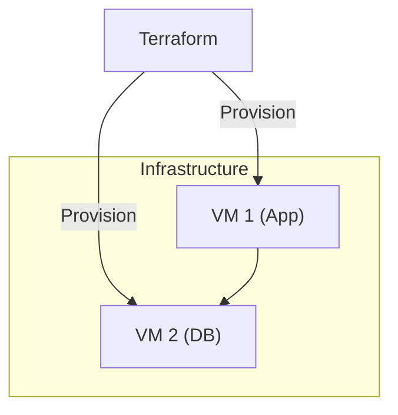

# GitHub Feature Creator

## Overview

This skill creates professional GitHub feature request issues using the `gh` CLI. It generates well-structured, succinct issues that follow patterns from popular open-source projects.

## When to Use

- User executes `/feature-gh <description>` command
- User asks to "create a GitHub feature issue"
- User requests "new GitHub feature request"

## Prerequisites

### GitHub CLI Installation

**macOS:**

```bash
brew install gh
gh auth login
```

**Linux (Debian/Ubuntu):**

```bash
curl -fsSL https://cli.github.com/packages/githubcli-archive-keyring.gpg | sudo dd of=/usr/share/keyrings/githubcli-archive-keyring.gpg
echo "deb [arch=$(dpkg --print-architecture) signed-by=/usr/share/keyrings/githubcli-archive-keyring.gpg] https://cli.github.com/packages stable main" | sudo tee /etc/apt/sources.list.d/github-cli.list > /dev/null
sudo apt update
sudo apt install gh
gh auth login
```

**Windows:**

```powershell
winget install --id GitHub.cli
gh auth login
```

### Authentication

Ensure you're authenticated:

```bash
gh auth status
```

If not authenticated, run:

```bash
gh auth login
```

## Workflow

### 1. Parse Input

Extract the feature description from user input:

- Accept short descriptions (3-10 words minimum)
- Accept longer detailed descriptions
- If description is too vague, ask clarifying questions

### 2. Detect Repository Context

Check if we're in a git repository with a GitHub remote:

```bash
# Check if in git repo
git rev-parse --is-inside-work-tree 2>/dev/null

# Get GitHub remote
gh repo view --json nameWithOwner -q .nameWithOwner 2>/dev/null
```

If not in a GitHub repo, ask user to specify the repository (format: `owner/repo`).

### 3. Generate Issue Structure

Use the shared template structure from `_shared/feature-templates/ISSUE_STRUCTURE.md`.

**Key points:**

- Clear, actionable title (50-70 characters)
- Start with action verbs: "Add", "Support", "Implement", "Enable"
- Include Summary, Motivation, Proposed Solution sections
- Use Mermaid diagrams for architecture/flows (see Mermaid Best Practices below)
- Keep sections to 1-3 sentences
- Condense based on input detail level

**Mermaid Best Practices:**

When including Mermaid diagrams in issue descriptions:

- Avoid HTML tags like `<br/>` - use parentheses or dashes instead for multi-line labels
- Use quoted labels for nodes: `CP1["Control Plane 1"]` instead of `CP1[Control Plane 1<br/>Details]`
- Use subgraph aliases for better readability: `subgraph Proxmox["Infrastructure"]`
- Keep diagrams simple and focused on the key architecture
- Test that diagrams render properly in GitHub's markdown preview

Example of properly formatted Mermaid:



### 4. Create the GitHub Issue

Use `gh issue create` with the generated content:

```bash
gh issue create \
  --repo <owner/repo> \
  --title "<generated-title>" \
  --body "<generated-body>" \
  --label "enhancement,feature-request"
```

**Optional flags** (ask user if needed):

- `--assignee <username>` - Assign to someone
- `--milestone <milestone>` - Add to milestone
- `--project <project>` - Add to project board
- `--label <additional-labels>` - Extra labels beyond default

### 5. Confirm Creation

After successful creation:

```text
✅ GitHub Issue created successfully!

URL: https://github.com/owner/repo/issues/123
Issue: #123
Labels: enhancement, feature-request
```

## Examples

### Example 1: Minimal Description

**User Input:**

```text
/feature-gh add dark mode support
```

**Generated Issue:**

**Title:** `Add dark mode support for UI components`

**Body:**

```markdown
## Summary

Add support for dark mode theme across all UI components to improve user experience in low-light environments.

## Motivation

Users working in low-light conditions would benefit from a dark color scheme. This is a commonly requested feature that improves accessibility and reduces eye strain.

## Proposed Solution

Implement a theme toggle that switches between light and dark color palettes, persisting user preference in localStorage.
```

### Example 2: Moderate Description

**User Input:**

```text
/feature gh add support for importing terraform modules from private git repos using ssh authentication
```

**Generated Issue:**

**Title:** `Support SSH authentication for private Git repository module imports`

**Body:**

```markdown
## Summary

Enable Terraform module imports from private Git repositories using SSH authentication as an alternative to HTTPS.

## Motivation

Teams using SSH keys for Git authentication cannot currently import private modules without setting up HTTPS credentials. SSH authentication is more secure for automated workflows and CI/CD pipelines.

## Proposed Solution

- Support `git::ssh://` URL scheme in module sources
- Allow SSH key configuration via environment variables or config files
- Update documentation with SSH authentication examples

## Additional Context

Similar to how Terraform Cloud handles private module sources.
```

## Error Handling

### No GitHub Remote

```text
❌ Not in a GitHub repository.

Please specify repository: /feature-gh <description> --repo owner/repo
```

### gh CLI Not Installed

```text
❌ GitHub CLI (gh) not found.

Install with: brew install gh
Or visit: <https://cli.github.com>
```

### gh Not Authenticated

```text
❌ Not authenticated with GitHub.

Run: gh auth login
```

### Issue Creation Failed

```text
❌ Failed to create issue: [error details]

Verify:
- Repository exists and you have write access
- Labels exist in the repository
- Milestone/project exists (if specified)
```

## Configuration

Allow user to set defaults in OpenCode config:

```yaml
skills:
  feature-gh:
    default_repo: "owner/repo"  # Skip repo detection
    default_labels:
      - "enhancement"
      - "needs-triage"
    auto_assign: true  # Assign to authenticated user
    template: "standard"  # or "minimal", "detailed"
```

## Label Strategy

Default labels to apply:

- `enhancement` or `feature-request` (standard across projects)

Suggest additional labels based on content:

- `documentation` if docs are mentioned
- `performance` if related to speed/optimization
- `security` if related to vulnerabilities/auth
- `api` if related to API changes
- `breaking-change` if backward compatibility affected

## Success Criteria

A well-created GitHub feature issue should:

- ✅ Have a clear, actionable title
- ✅ Explain the problem/motivation
- ✅ Propose a concrete solution
- ✅ Be succinct (under 500 words)
- ✅ Use proper markdown formatting
- ✅ Include relevant labels
- ✅ Be immediately actionable by maintainers
