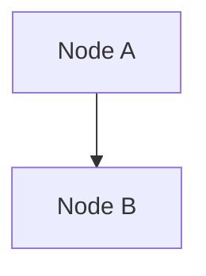
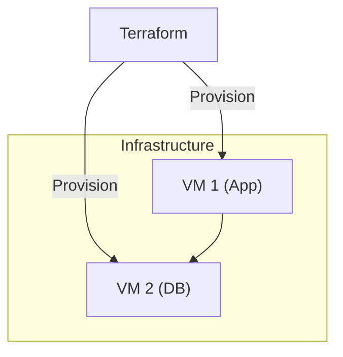
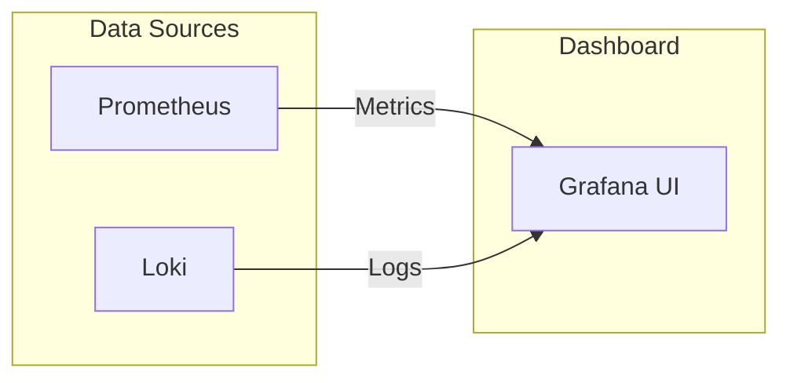

# Gitea Feature Creator

## Overview

This skill creates professional Gitea feature request issues using the `tea` CLI. It generates well-structured, succinct issues that follow patterns from popular open-source projects.

## When to Use

- User executes `/feature-tea <description>` command
- User asks to "create a Gitea feature issue"
- User requests "new Gitea feature request"
- User is working with self-hosted Gitea instances

## Prerequisites

### Gitea CLI (tea) Installation

**macOS:**

```bash
brew install tea
tea login add
```

**Linux (using Go):**

```bash
go install code.gitea.io/tea@latest
tea login add
```

**Windows:**

```powershell
scoop install tea
tea login add
```

**Manual binary download:**

Visit <https://gitea.com/gitea/tea/releases> and download the appropriate binary for your platform.

### Configuration

Configure tea with your Gitea instance:

```bash
# Interactive setup
tea login add

# Or manual setup
tea login add \
  --name "MyGitea" \
  --url "https://gitea.example.com" \
  --token "your-access-token"
```

Verify configuration:

```bash
tea login list
```

## Workflow

### 1. Parse Input

Extract the feature description from user input:

- Accept short descriptions (3-10 words minimum)
- Accept longer detailed descriptions
- If description is too vague, ask clarifying questions

### 2. Detect Repository Context

Check if we're in a git repository with a Gitea remote:

```bash
# Check if in git repo
git rev-parse --is-inside-work-tree 2>/dev/null

# List Gitea remotes
tea login list 2>/dev/null

# Get current repository info
tea repos ls 2>/dev/null
```

If not configured, ask user to specify Gitea instance and repository (format: `owner/repo`).

Alternative: Detect from git remote

```bash
# Get remote URL
git config --get remote.origin.url

# Parse Gitea instance from URL
# Example: https://gitea.example.com/owner/repo.git
```

### 3. Generate Issue Structure

Use the shared template structure from `_shared/feature-templates/ISSUE_STRUCTURE.md`.

**Key points:**

- Clear, actionable title (50-70 characters)
- Start with action verbs: "Add", "Support", "Implement", "Enable"
- Include Summary, Motivation, Proposed Solution sections
- Use Mermaid diagrams for architecture/flows (see Mermaid Best Practices below)
- Keep sections to 1-3 sentences
- Condense based on input detail level

**Mermaid Best Practices:**

When including Mermaid diagrams in issue descriptions:

- Avoid HTML tags like `<br/>` - use parentheses or dashes instead for multi-line labels
- Use quoted labels for nodes: `CP1["Control Plane 1"]` instead of `CP1[Control Plane 1<br/>Details]`
- Use subgraph aliases for better readability: `subgraph Proxmox["Infrastructure"]`
- Keep diagrams simple and focused on the key architecture
- Test that diagrams render properly in Gitea's markdown preview

CRITICAL: Mermaid in Heredoc

When using `cat <<'EOF'` heredoc syntax to pass descriptions to `tea issues create`, you MUST use triple backticks without any escaping:

✅ CORRECT:

```bash
tea issues create --description "$(cat <<'EOF'
## Architecture



EOF
)"

```text

❌ INCORRECT:

```bash
tea issues create --description "$(cat <<'EOF'
## Architecture

\`\`\`mermaid   # WRONG - escaped backticks
graph TB
    A["Node A"]
    B["Node B"]
    A --> B
\`\`\`           # WRONG - escaped backticks
EOF
)"

```

The single quotes in `<<'EOF'` prevent variable expansion and allow raw backticks to pass through correctly.

Example of properly formatted Mermaid:



### 4. Create the Gitea Issue

Use `tea issues create` with the generated content:

```bash
tea issues create \
  --repo <owner/repo> \
  --title "<generated-title>" \
  --description "<generated-description>" \
  --labels "enhancement,feature-request"
```

**Optional flags** (ask user if needed):

- `--assignees <username>` - Assign to someone (note: plural)
- `--milestone <milestone>` - Add to milestone
- `--labels <additional-labels>` - Extra labels beyond default (comma-separated)
- `--deadline <date>` - Set due date (format: YYYY-MM-DD)

**Note:** Use `--labels` (plural) instead of `--label` for Gitea tea CLI.

### 5. Confirm Creation

After successful creation:

```text
✅ Gitea Issue created successfully!

URL: https://gitea.example.com/owner/repo/issues/45
Issue: #45
Labels: enhancement, feature-request
```

## Examples

### Example 1: Minimal Description

**User Input:**

```text
/feature-tea add dark mode support
```

**Generated Issue:**

**Title:** `Add dark mode support for UI components`

**Body:**

```markdown
## Summary

Add support for dark mode theme across all UI components to improve user experience in low-light environments.

## Motivation

Users working in low-light conditions would benefit from a dark color scheme. This is a commonly requested feature that improves accessibility and reduces eye strain.

## Proposed Solution

Implement a theme toggle that switches between light and dark color palettes, persisting user preference in localStorage.
```

### Example 2: With Deadline and Assignee

**User Input:**

```text
/feature-tea implement rate limiting --assignee johndoe --deadline 2024-12-31
```

**CLI Command:**

```bash
tea issues create \
  --repo owner/repo \
  --title "Implement rate limiting for API endpoints" \
  --description "..." \
  --labels "enhancement,feature-request" \
  --assignees "johndoe" \
  --deadline "2024-12-31"
```

### Example 3: With Mermaid Diagram

**User Input:**

```text
/feature-tea add monitoring dashboard with metrics visualization
```

**CLI Command (showing proper Mermaid formatting):**

```bash
tea issues create \
  --title "Add monitoring dashboard with metrics visualization" \
  --description "$(cat <<'EOF'
## Summary

Create a monitoring dashboard that visualizes system metrics in real-time.

## Architecture



## Acceptance Criteria

- [ ] Dashboard displays CPU and memory metrics
- [ ] Real-time updates every 5 seconds
- [ ] Responsive design for mobile devices
EOF
)" \
  --labels "enhancement,monitoring"

```yaml

**Key Points:**
- Use `<<'EOF'` (with single quotes) to preserve backticks literally
- Triple backticks for Mermaid are NOT escaped (`\`\`\``)
- The heredoc allows multi-line descriptions with proper formatting

## Error Handling

### No Gitea Remote

```text
❌ Not in a Gitea repository or tea not configured.

Please configure tea first:
  tea login add

Or specify repository: /feature-tea <description> --repo owner/repo
```

### tea CLI Not Installed

```text
❌ Gitea CLI (tea) not found.

Install with:
  brew install tea (macOS)
  go install code.gitea.io/tea@latest
Or visit: <https://gitea.com/gitea/tea>
```

### tea Not Configured

```text
❌ No Gitea instances configured.

Run: tea login add
Follow the prompts to configure your Gitea instance.
```

### Issue Creation Failed

```text
❌ Failed to create issue: [error details]

Verify:
- Repository exists and you have write access
- Labels exist in the repository
- Milestone exists (if specified)
- Assignee has access to the repository
- Date format is YYYY-MM-DD for deadlines
```

## Configuration

Allow user to set defaults in OpenCode config:

```yaml
skills:
  feature-tea:
    default_instance: "gitea.example.com"
    default_repo: "owner/repo"
    default_labels:
      - "enhancement"
      - "feature-request"
    auto_assign: false  # Gitea may have different users than local git
    template: "standard"  # or "minimal", "detailed"
```

## Label Strategy

Default labels to apply:

- `enhancement` or `feature-request`

Suggest additional labels based on content:

- `documentation` if docs are mentioned
- `performance` if related to speed/optimization
- `security` if related to vulnerabilities/auth
- `api` if related to API changes
- `breaking-change` if backward compatibility affected

**Note:** Gitea labels are repository-specific and must be created in advance through the web UI or API.

## Gitea-Specific Features

### Deadline Support

Gitea supports due dates on issues:

```bash
tea issues create \
  --deadline "2024-12-31" \
  ...
```

### Repository Templates

If the Gitea repository has issue templates configured, tea will respect them. The generated content will be adapted to match template fields if detected.

## Success Criteria

A well-created Gitea feature issue should:

- ✅ Have a clear, actionable title
- ✅ Explain the problem/motivation
- ✅ Propose a concrete solution
- ✅ Be succinct (under 500 words)
- ✅ Use proper markdown formatting
- ✅ Include relevant labels
- ✅ Be immediately actionable by maintainers
- ✅ Leverage Gitea-specific features (deadlines) when appropriate
